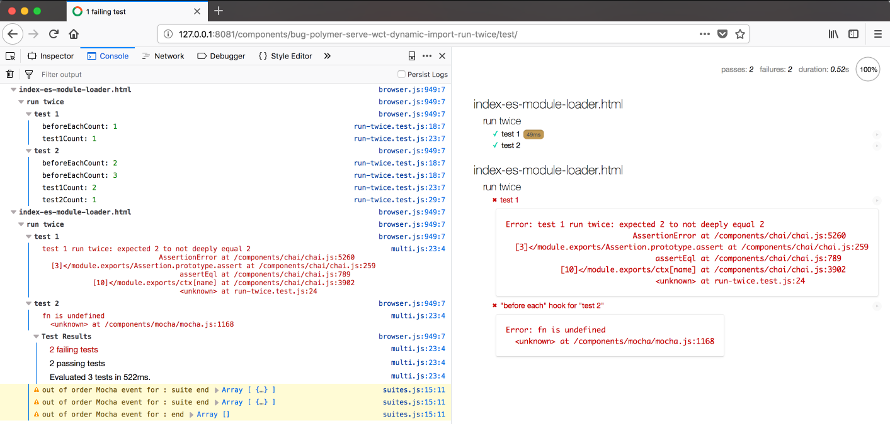

This is a live demo for the issue with WCT where tests run twice in Firefox when using dynamic imports.

```sh
bower install
polymer serve # checked with version 1.8.0
# open tests in Firefox (checked with version 62.0.2)
# http://127.0.0.1:8081/components/bug-polymer-serve-wct-dynamic-import-run-twice/test/
```

You'll see this


